<!--
  Every word on this page is drawn in assets/*.svg — there is no prose in this
  file on purpose, so the design stays in one place: scripts/build_assets.py.
  Regenerate with:  python scripts/build_assets.py
  Check the layout with:  python scripts/verify_assets.py
-->

  

  

  

